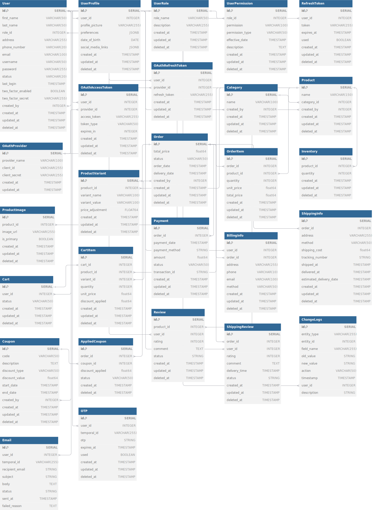

# go-fiber-e-commerse 

This project follows the Hexagonal Architecture (also known as Ports and Adapters Architecture), which aims to create a clear separation between the core business logic and external systems. The structure of the project is designed to ensure maintainability, testability, and scalability by decoupling various components.

## Project Structure

`cmd`
Contains the main application entry points. This is where the application starts and is responsible for setting up the application context, configuration, and running the server.

`internal`
The core of the application is divided into several packages:
- `adapters`: Contains the implementations for interacting with external systems.
  -  `app`: Application-level adapters.
  -  `database`: Database-related adapters, including models and seeders.
     - `models`: Database models used for ORM.
     - `seeders`: Scripts for populating the database with initial data.
   - `http`: HTTP-related adapters, including handlers and routers.
     - `handlers`: HTTP request handlers, organized by domain (e.g., documents, orders, system_fields).
     - `routers`: Routing configurations for handling HTTP requests and responses.
   - `repositories`: Data access repositories, organized by domain (e.g., documents, orders, system_fields).
 - `core`: Contains the business logic and domain-specific code.
	- `domain`: Domain models and business entities, organized by domain (e.g., documents, orders, system_fields).
	- `ports`: Interfaces that define the interactions between the core domain and the external systems.
    	- documents, master_files, orders, system_fields: Ports for different domains.

  - `services`: Business logic and use cases, organized by domain (e.g., documents, orders, system_fields).


`pkg`
Contains shared utilities and helpers that can be used across the application.

- `configs`: Configuration management.
- `helpers`: Utility functions for various tasks.
- `filters`: Helpers for filtering data.
- `pagination`: Helpers for pagination.
- `utils`: Additional utility functions, such as Argon2ID for password hashing


# Business Context

An e-commerce system is a digital platform designed to facilitate the buying and selling of goods and services over the internet. It provides a comprehensive online shopping experience for users, encompassing various functionalities to handle different aspects of the shopping lifecycle, from product discovery to purchase and delivery.

## Brief Entities

- [dbdocs: exclusive-e-comerse-example](https://dbdocs.io/lacakira/exclusive-e-comerse-example?view=table_structure)




### Core Entities
  - User: Manages user data and roles.
  - UserProfile: Contains additional profile information for users.
  - UserRole: Defines user roles and associated permissions.
  - UserPermission: Manages permissions linked to each role.
  - RefreshToken: Stores JWT refresh tokens for user sessions, including their expiration and usage status.
  - OAuthProvider: Manages OAuth providers used for external authentication.
  - OAuthAccessToken: Represents access tokens issued by OAuth providers for authentication and authorization.
  - OAuthRefreshToken: Represents refresh tokens used to obtain new access tokens after expiration.
  - Email: Stores information about emails sent to users, including recipient details, content, and status.
  - OTP: Stores one-time passwords (OTPs) used for user verification and authentication processes.

### Product Management
  - Category: Categorizes products.
  - Product: Stores product details.
  - ProductImage: Manages product images.
  - ProductVariant: Handles different product variants (e.g., size, color).

### Order Management
  - Order: Represents a customer's order.
  - OrderItem: Details of items within an order.
  - Inventory: Tracks product stock levels.
  - Payment: Handles payment information for orders.
  - BillingInfo: Stores billing details for orders.
  - ShippingInfo: Manages shipping details and status for orders.

### Shopping Cart
  - Cart: Represents a user's shopping cart.
  - CartItem: Stores items added to the cart.

### Marketing and Discounts
  - Coupon: Manages discount codes.
  - AppliedCoupon: Tracks coupons applied to orders.

### Reviews and Ratings
  - Review: Captures product reviews and ratings.
  - ShippingReview: Stores user reviews specifically for shipping experiences.

### Change Tracking
  - ChangeLogs: Records changes made to entities for auditing purposes.


## ER Diagram

### Core Entities
  
#### User: Manages user data and roles.

**Description**: Represents users of the system with various roles (ADMIN, SELLER, CUSTOMER). This table manages user details and tracks who created each record.

| Column Name         | Data Type  | Constraints                                | Description                                                |
|---------------------|------------|--------------------------------------------|------------------------------------------------------------|
| `id`                | `SERIAL`   | `PRIMARY KEY`                              | Unique identifier for each user.                          |
| `first_name`        | `VARCHAR(50)`|                                            | User's first name.                                        |
| `last_name`         | `VARCHAR(50)`|                                            | User's last name.                                         |
| `role_id`           | `INTEGER`  | `REFERENCES UserRole(id)`                  | References the UserRole table to assign a role to the user.|
| `address`           | `VARCHAR(255)`|                                            | User's address for contact and authentication purposes.    |
| `phone_number`      | `VARCHAR(20)`|                                            | User's phone number.                                      |
| `email`             | `VARCHAR(100)`|                                            | User's email address.                                    |
| `username`          | `VARCHAR(50)`|                                            | User's chosen username.                                  |
| `password`          | `VARCHAR(255)`|                                            | User's hashed password.                                  |
| `status`            | `VARCHAR(20)`|                                            | Status of the user account (e.g., 'Active', 'Inactive').  |
| `last_login`        | `TIMESTAMP`|                                            | Timestamp of the last time the user logged in.            |
| `two_factor_enabled`| `BOOLEAN`  |                                            | Indicates if two-factor authentication is enabled for the user. |
| `two_factor_secret` | `VARCHAR(255)`|                                            | Secret used for generating 2FA codes. (Only if 2FA is enabled) |
| `created_by`        | `INTEGER`  | `REFERENCES User(id)`                      | References the user who created this record, enabling tracking of record creation. |
| `created_at`        | `TIMESTAMP`| `DEFAULT CURRENT_TIMESTAMP`                | Timestamp when the record was created.                    |
| `updated_at`        | `TIMESTAMP`| `DEFAULT CURRENT_TIMESTAMP`                | Timestamp when the record was last updated.               |
| `deleted_at`        | `TIMESTAMP`| `DEFAULT NULL`                             | Timestamp for soft deletes, marking the record as deleted without actual removal. |

**Notes**:
- `id`: Auto-incrementing primary key.
- `role_id` references the `UserRole` table to assign roles.
- `created_by` references the `User` table for tracking record creation.
- `deleted_at` allows for soft deletes.

```sql
Table User [NOTE: "Represents users of the system with various roles (ADMIN, SELLER, CUSTOMER). This table manages user details and tracks who created each record."] {
  id SERIAL [pk, NOTE: "Unique identifier for each user."]
  first_name VARCHAR(50) [NOTE: "User's first name."]
  last_name VARCHAR(50) [NOTE: "User's last name."]
  role_id INTEGER [ref: > UserRole.id, NOTE: "References the UserRole table to assign a role to the user."]
  address VARCHAR(255) [NOTE: "User's address for contact and authentication purposes."]
  phone_number VARCHAR(20) [NOTE: "User's phone number."]
  email VARCHAR(100) [NOTE: "User's email address."]
  username VARCHAR(50) [NOTE: "User's chosen username."]
  password VARCHAR(255) [NOTE: "User's hashed password."]
  status VARCHAR(20) [NOTE: "Status of the user account (e.g., 'Active', 'Inactive')."]
  last_login TIMESTAMP [NOTE: "Timestamp of the last time the user logged in."]
  two_factor_enabled BOOLEAN [NOTE: "Indicates if two-factor authentication is enabled for the user."]
  two_factor_secret VARCHAR(255) [NOTE: "Secret used for generating 2FA codes. (Only if 2FA is enabled)"]
  created_by INTEGER [ref: > User.id, NOTE: "References the user who created this record, enabling tracking of record creation."]
  created_at TIMESTAMP [default: `CURRENT_TIMESTAMP`, NOTE: "Timestamp when the record was created."]
  updated_at TIMESTAMP [default: `CURRENT_TIMESTAMP`, NOTE: "Timestamp when the record was last updated."]
  deleted_at TIMESTAMP [default: NULL, NOTE: "Timestamp for soft deletes, marking the record as deleted without actual removal."]
}
```


#### UserProfile Table

**Description**: Stores additional profile information for users, including profile pictures and user preferences.

| Column Name          | Data Type | Constraints                              | Description                                                |
|----------------------|-----------|------------------------------------------|------------------------------------------------------------|
| `id`                 | `SERIAL`  | `PRIMARY KEY`                            | Unique identifier for each user profile.                  |
| `user_id`            | `INTEGER` | `REFERENCES User(id)`                    | References the `User` table, linking the profile to a specific user. |
| `profile_picture`    | `VARCHAR(255)`  |                                          | URL or path to the user's profile picture.                |
| `preferences`        | `JSONB`   |                                          | JSON object storing user-specific preferences and settings.|
| `date_of_birth`      | `DATE`    |                                          | User's date of birth.                                    |
| `social_media_links` | `JSONB`   |                                          | JSON object storing links to user's social media profiles.|
| `created_at`         | `TIMESTAMP`| `DEFAULT CURRENT_TIMESTAMP`              | Timestamp when the profile was created.                   |
| `updated_at`         | `TIMESTAMP`| `DEFAULT CURRENT_TIMESTAMP`              | Timestamp when the profile was last updated.              |
| `deleted_at`         | `TIMESTAMP`| `DEFAULT NULL`                           | Timestamp for soft deletes, marking the record as deleted without actual removal. |

**Notes**:
- `id`: Auto-incrementing primary key.
- `user_id` references the `User` table to link the profile with the corresponding user.
- `preferences` and `social_media_links` are stored as JSONB for flexibility.
- `created_at` and `updated_at` track record creation and modification times.
- `deleted_at` allows for soft deletes.


```sql
Table UserProfile [NOTE: "Stores additional profile information for users, including profile pictures and user preferences."] {
  id SERIAL [pk, NOTE: "Unique identifier for each user profile."]
  user_id INTEGER [ref: > User.id, NOTE: "References the User table, linking the profile to a specific user."]
  profile_picture VARCHAR(255) [NOTE: "URL or path to the user's profile picture."]
  preferences JSONB [NOTE: "JSON object storing user-specific preferences and settings."]
  date_of_birth DATE [NOTE: "User's date of birth."]
  social_media_links JSONB [NOTE: "JSON object storing links to user's social media profiles."]
  created_at TIMESTAMP [default: `CURRENT_TIMESTAMP`, NOTE: "Timestamp when the profile was created."]
  updated_at TIMESTAMP [default: `CURRENT_TIMESTAMP`, NOTE: "Timestamp when the profile was last updated."]
  deleted_at TIMESTAMP [default: NULL, NOTE: "Timestamp for soft deletes, marking the record as deleted without actual removal."]
}
```

#### UserRole Table

**Description**: Defines user roles and associated permissions. Roles may include ADMIN, SELLER, and CUSTOMER, with descriptions for each role's purpose within the system.

| Column Name     | Data Type  | Constraints                              | Description                                               |
|-----------------|------------|------------------------------------------|-----------------------------------------------------------|
| `id`            | `SERIAL`   | `PRIMARY KEY`                            | Unique identifier for each user role.                    |
| `role_name`     | `VARCHAR(50)`   |                                          | Name of the role (e.g., 'ADMIN', 'SELLER', 'CUSTOMER').  |
| `description`   | `VARCHAR(255)`   |                                          | Description of the role and its purpose within the system.|
| `created_at`    | `TIMESTAMP`| `DEFAULT CURRENT_TIMESTAMP`              | Timestamp when the role was created.                     |
| `updated_at`    | `TIMESTAMP`| `DEFAULT CURRENT_TIMESTAMP`              | Timestamp when the role was last updated.                |
| `deleted_at`    | `TIMESTAMP`| `DEFAULT NULL`                           | Timestamp for soft deletes, marking the record as deleted without actual removal. |

**Notes**:
- `id`: Auto-incrementing primary key.
- `role_name` provides the name for the role.
- `description` gives context about the role's function within the system.
- `created_at` and `updated_at` track record creation and updates.
- `deleted_at` allows for soft deletes.

```sql
Table UserRole [NOTE: "Defines the roles available in the system, such as ADMIN, SELLER, and CUSTOMER, and provides descriptions for each role."] {
  id SERIAL [pk, NOTE: "Unique identifier for each user role."]
  role_name VARCHAR(50) [NOTE: "Name of the role (e.g., 'ADMIN', 'SELLER', 'CUSTOMER')."]
  description VARCHAR(255) [NOTE: "Description of the role and its purpose within the system."]
  created_at TIMESTAMP [default: `CURRENT_TIMESTAMP`, NOTE: "Timestamp when the profile was created."]
  updated_at TIMESTAMP [default: `CURRENT_TIMESTAMP`, NOTE: "Timestamp when the profile was last updated."]
  deleted_at TIMESTAMP [default: NULL, NOTE: "Timestamp for soft deletes, marking the record as deleted without actual removal."]
}
```


#### UserPermission Table

**Description**: Manages permissions linked to each role, specifying what actions each role can perform.

| Column Name        | Data Type      | Constraints                              | Description                                               |
|--------------------|----------------|------------------------------------------|-----------------------------------------------------------|
| `id`               | `SERIAL`       | `PRIMARY KEY`                            | Unique identifier for each permission record.            |
| `role_id`          | `INTEGER`      | `REFERENCES UserRole(id)`                | References the `UserRole` table, linking permissions to specific roles. |
| `permission`       | `VARCHAR(100)` |                                          | Description of the permission (e.g., 'CREATE_PRODUCT', 'VIEW_ORDERS'). |
| `permission_type`  | `VARCHAR(50)`  |                                          | Type of permission (e.g., 'Read', 'Write', 'Admin').     |
| `effective_date`   | `TIMESTAMP`    |                                          | Timestamp when the permission became effective.          |
| `description`      | `TEXT`         |                                          | Brief description of the permissions associated with this role. |
| `created_at`       | `TIMESTAMP`    | `DEFAULT CURRENT_TIMESTAMP`              | Timestamp when the record was created.                   |
| `updated_at`       | `TIMESTAMP`    | `DEFAULT CURRENT_TIMESTAMP`              | Timestamp when the record was last updated.              |
| `deleted_at`       | `TIMESTAMP`    | `DEFAULT NULL`                           | Timestamp for soft deletes, marking the record as deleted without actual removal. |

**Notes**:
- `id`: Auto-incrementing primary key.
- `role_id` links the permission to a specific role defined in the `UserRole` table.
- `permission` and `permission_type` specify the actions that the role can perform.
- `effective_date` tracks when the permission was applied.
- `description` provides additional context about the permission.
- `created_at` and `updated_at` track when the record was created and modified.
- `deleted_at` allows for soft deletes.

```sql
Table UserPermission [NOTE: "Manages permissions associated with user roles, specifying what actions each role can perform."] {
  id SERIAL [pk, NOTE: "Unique identifier for each permission record."]
  role_id INTEGER [ref: > UserRole.id, NOTE: "References the UserRole table to link permissions to specific roles."]
  permission VARCHAR(100) [NOTE: "Description of the permission (e.g., 'CREATE_PRODUCT', 'VIEW_ORDERS')."]
  permission_type VARCHAR(50) [NOTE: "Type of permission (e.g., 'Read', 'Write', 'Admin')."]
  effective_date TIMESTAMP [NOTE: "Timestamp when the permission became effective."]
  description TEXT [NOTE: "Brief description of the permissions associated with this role."]
  created_at TIMESTAMP [default: `CURRENT_TIMESTAMP`, NOTE: "Timestamp when the permission record was created."]
  updated_at TIMESTAMP [default: `CURRENT_TIMESTAMP`, NOTE: "Timestamp when the permission record was last updated."]
  deleted_at TIMESTAMP [default: NULL, NOTE: "Timestamp for soft deletes, marking the record as deleted without actual removal."]
}
```

#### RefreshToken Table

**Description**: Stores JWT refresh tokens for user sessions, including their expiration and usage status.

| Column Name   | Data Type      | Constraints                              | Description                                               |
|---------------|----------------|------------------------------------------|-----------------------------------------------------------|
| `id`          | `SERIAL`       | `PRIMARY KEY`                            | Unique identifier for each refresh token record.         |
| `user_id`     | `INTEGER`      | `REFERENCES User(id)`                    | References the `User` table to link the refresh token to a specific user. |
| `token`       | `VARCHAR(255)` |                                          | JWT refresh token string used to renew user authentication sessions. |
| `expires_at`  | `TIMESTAMP`    |                                          | Timestamp indicating when the refresh token will expire. |
| `used`        | `BOOLEAN`      | `DEFAULT FALSE`                          | Indicates whether the refresh token has been used to issue a new token. |
| `created_at`  | `TIMESTAMP`    | `DEFAULT CURRENT_TIMESTAMP`              | Timestamp when the refresh token record was created.     |
| `updated_at`  | `TIMESTAMP`    | `DEFAULT CURRENT_TIMESTAMP`              | Timestamp when the refresh token record was last updated.|
| `deleted_at`  | `TIMESTAMP`    | `DEFAULT NULL`                           | Timestamp for soft deletes, marking the record as deleted without actual removal. |

**Notes**:
- `id`: Auto-incrementing primary key.
- `user_id` links the refresh token to a specific user in the `User` table.
- `token` stores the actual JWT refresh token.
- `expires_at` indicates when the token is no longer valid.
- `used` tracks whether the token has been utilized.
- `created_at` and `updated_at` track when the record was created and modified.
- `deleted_at` allows for soft deletes.


```sql
Table RefreshToken [NOTE: "Stores JWT refresh tokens for user sessions, including their expiration and usage status."] {
  id SERIAL [pk, NOTE: "Unique identifier for each refresh token record."]
  user_id INTEGER [ref: > User.id, NOTE: "References the User table to link the refresh token to a specific user."]
  token VARCHAR(255) [NOTE: "JWT refresh token string used to renew user authentication sessions."]
  expires_at TIMESTAMP [NOTE: "Timestamp indicating when the refresh token will expire."]
  used BOOLEAN [default: FALSE, NOTE: "Indicates whether the refresh token has been used to issue a new token."]
  created_at TIMESTAMP [default: `CURRENT_TIMESTAMP`, NOTE: "Timestamp when the refresh token record was created."]
  updated_at TIMESTAMP [default: `CURRENT_TIMESTAMP`, NOTE: "Timestamp when the refresh token record was last updated."]
  deleted_at TIMESTAMP [default: NULL, NOTE: "Timestamp for soft deletes, marking the record as deleted without actual removal."]
}
```

#### OAuthProvider Table

**Description**: Manages OAuth providers used for external authentication.

| Column Name     | Data Type  | Constraints                              | Description                                               |
|-----------------|------------|------------------------------------------|-----------------------------------------------------------|
| `id`            | `SERIAL`   | `PRIMARY KEY`                            | Unique identifier for each OAuth provider.               |
| `provider_name` | `VARCHAR(100)`   |                                          | Name of the OAuth provider (e.g., 'Google', 'Facebook'). |
| `client_id`     | `VARCHAR(255)`   |                                          | Client ID provided by the OAuth provider.                |
| `client_secret` | `VARCHAR(255)`   |                                          | Client Secret provided by the OAuth provider.            |
| `created_at`    | `TIMESTAMP`| `DEFAULT CURRENT_TIMESTAMP`              | Timestamp when the record was created.                   |
| `updated_at`    | `TIMESTAMP`| `DEFAULT CURRENT_TIMESTAMP`              | Timestamp when the record was last updated.              |

**Notes**:
- `id`: Auto-incrementing primary key.
- `provider_name` specifies the name of the OAuth provider used for authentication.
- `client_id` and `client_secret` are used to authenticate with the OAuth provider.
- `created_at` and `updated_at` track the creation and modification times of the record.

```sql
Table OAuthProvider [NOTE: "Contains information about OAuth providers."] {
  id SERIAL [pk, NOTE: "Unique identifier for each OAuth provider."]
  provider_name VARCHAR(100) [NOTE: "Name of the OAuth provider (e.g., 'Google', 'Facebook')."]
  client_id VARCHAR(255) [NOTE: "Client ID provided by the OAuth provider."]
  client_secret VARCHAR(255) [NOTE: "Client Secret provided by the OAuth provider."]
  created_at TIMESTAMP [default: `CURRENT_TIMESTAMP`, NOTE: "Timestamp when the record was created."]
  updated_at TIMESTAMP [default: `CURRENT_TIMESTAMP`, NOTE: "Timestamp when the record was last updated."]
}
```

#### OAuthAccessToken Table

**Description**: Represents access tokens issued by OAuth providers for authentication and authorization.

| Column Name     | Data Type  | Constraints                              | Description                                               |
|-----------------|------------|------------------------------------------|-----------------------------------------------------------|
| `id`            | `SERIAL`   | `PRIMARY KEY`                            | Unique identifier for each access token.                 |
| `user_id`       | `INTEGER`  | `REFERENCES User(id)`                    | References the User table to link the token to a specific user. |
| `provider_id`   | `INTEGER`  | `REFERENCES OAuthProvider(id)`           | References the OAuthProvider table to identify the provider of the token. |
| `access_token`  | `VARCHAR(255)`   |                                          | The OAuth access token string.                           |
| `token_type`    | `VARCHAR(50)`   |                                          | Type of token (e.g., 'Bearer').                          |
| `expires_in`    | `INTEGER`  |                                          | Token expiration time in seconds.                       |
| `created_at`    | `TIMESTAMP`| `DEFAULT CURRENT_TIMESTAMP`              | Timestamp when the access token was created.             |
| `updated_at`    | `TIMESTAMP`| `DEFAULT CURRENT_TIMESTAMP`              | Timestamp when the access token was last updated.        |
| `deleted_at`    | `TIMESTAMP`| `DEFAULT NULL`                           | Timestamp for soft deletes, marking the record as deleted without actual removal. |

**Notes**:
- `id`: Auto-incrementing primary key.
- `user_id` links the token to a specific user.
- `provider_id` identifies the OAuth provider that issued the token.
- `access_token` is the actual token used for accessing protected resources.
- `token_type` specifies the type of token issued.
- `expires_in` indicates how long the token is valid in seconds.
- `created_at` and `updated_at` track the creation and modification times of the token.

```sql
Table OAuthAccessToken [NOTE: "Records OAuth access tokens issued to users."] {
  id SERIAL [pk, NOTE: "Unique identifier for each access token."]
  user_id INTEGER [ref: > User.id, NOTE: "References the User table to link the token to a specific user."]
  provider_id INTEGER [ref: > OAuthProvider.id, NOTE: "References the OAuthProvider table to identify the provider of the token."]
  access_token VARCHAR(255) [NOTE: "The OAuth access token."]
  token_type VARCHAR(50) [NOTE: "Type of token (e.g., 'Bearer')."]
  expires_in INTEGER [NOTE: "Token expiration time in seconds."]
  created_at TIMESTAMP [default: `CURRENT_TIMESTAMP`, NOTE: "Timestamp when the access token was created."]
  updated_at TIMESTAMP [default: `CURRENT_TIMESTAMP`, NOTE: "Timestamp when the access token was last updated."]
  deleted_at TIMESTAMP [default: NULL, NOTE: "Timestamp for soft deletes, marking the token record as deleted without actual removal."]
}
```

#### OAuthRefreshToken Table

**Description**: Represents refresh tokens used to obtain new access tokens after expiration.

| Column Name      | Data Type  | Constraints                              | Description                                               |
|------------------|------------|------------------------------------------|-----------------------------------------------------------|
| `id`             | `SERIAL`   | `PRIMARY KEY`                            | Unique identifier for each refresh token.                |
| `user_id`        | `INTEGER`  | `REFERENCES User(id)`                    | References the User table to link the token to a specific user. |
| `provider_id`    | `INTEGER`  | `REFERENCES OAuthProvider(id)`           | References the OAuthProvider table to identify the provider of the token. |
| `refresh_token`  | `VARCHAR(255)`   |                                          | The OAuth refresh token string.                          |
| `created_at`     | `TIMESTAMP`| `DEFAULT CURRENT_TIMESTAMP`              | Timestamp when the refresh token was created.            |
| `updated_at`     | `TIMESTAMP`| `DEFAULT CURRENT_TIMESTAMP`              | Timestamp when the refresh token was last updated.       |
| `deleted_at`     | `TIMESTAMP`| `DEFAULT NULL`                           | Timestamp for soft deletes, marking the record as deleted without actual removal. |

**Notes**:
- `id`: Auto-incrementing primary key.
- `user_id` links the refresh token to a specific user.
- `provider_id` identifies the OAuth provider that issued the token.
- `refresh_token` is the actual token used to obtain new access tokens.
- `created_at` and `updated_at` track the creation and modification times of the token.


```sql
Table OAuthRefreshToken [NOTE: "Records OAuth refresh tokens issued to users."] {
  id SERIAL [pk, NOTE: "Unique identifier for each refresh token."]
  user_id INTEGER [ref: > User.id, NOTE: "References the User table to link the token to a specific user."]
  provider_id INTEGER [ref: > OAuthProvider.id, NOTE: "References the OAuthProvider table to identify the provider of the token."]
  refresh_token VARCHAR(255) [NOTE: "The OAuth refresh token."]
  created_at TIMESTAMP [default: `CURRENT_TIMESTAMP`, NOTE: "Timestamp when the refresh token was created."]
  updated_at TIMESTAMP [default: `CURRENT_TIMESTAMP`, NOTE: "Timestamp when the refresh token was last updated."]
  deleted_at TIMESTAMP [default: NULL, NOTE: "Timestamp for soft deletes, marking the token record as deleted without actual removal."]
}
```

#### Email Table

**Description**: Stores information about emails sent to users, including recipient details, content, and status.

| Column Name      | Data Type  | Constraints                              | Description                                               |
|------------------|------------|------------------------------------------|-----------------------------------------------------------|
| `id`             | `SERIAL`   | `PRIMARY KEY`                            | Unique identifier for each email record.                 |
| `user_id`        | `INTEGER`  | `REFERENCES User(id)`                    | References the User table to link the email to a specific user. |
| `temporal_id`    | `VARCHAR(255)` | `UNIQUE`                                 | Unique identifier generated by Temporal services for tracking purposes. |
| `recipient_email`| `VARCHAR(255)` |                                      | Email address of the recipient.                          |
| `subject`        | `VARCHAR(255)` |                                      | Subject line of the email.                               |
| `body`           | `TEXT`     |                                          | Body content of the email.                               |
| `status`         | `VARCHAR(50)`  |                                      | Current status of the email (e.g., 'sent', 'failed').    |
| `sent_at`        | `TIMESTAMP`| `DEFAULT CURRENT_TIMESTAMP`              | Timestamp when the email was sent.                       |
| `failed_reason`  | `TEXT`     |                                          | Reason for failure if the email was not successfully sent. |

**Notes**:
- `id`: Auto-incrementing primary key.
- `user_id` links the email to a specific user.
- `temporal_id` is a unique identifier from Temporal services for tracking the Email's processing.
- `recipient_email` contains the recipient's email address.
- `subject` and `body` define the content of the email.
- `status` indicates the current status of the email delivery.
- `sent_at` tracks when the email was sent.
- `failed_reason` provides details if the email failed to send.

```sql
Table Email [NOTE: "Stores information about emails sent to users, including recipient details, content, and status."] {
    id SERIAL [pk, NOTE: "Unique identifier for each email record."]
    user_id INTEGER [ref: > User.id, NOTE: "References the User table to link the email to a specific user."]
    temporal_id VARCHAR(255) [NOTE: "Unique identifier from Temporal services for tracking purposes."]
    recipient_email STRING [NOTE: "Email address of the recipient."]
    subject STRING [NOTE: "Subject line of the email."]
    body TEXT [NOTE: "Body content of the email."]
    status STRING [NOTE: "Current status of the email (e.g., 'sent', 'failed')."]
    sent_at TIMESTAMP [default: `CURRENT_TIMESTAMP`, NOTE: "Timestamp when the email was sent."]
    failed_reason TEXT [NOTE: "Reason for failure if the email was not successfully sent."]
}
```


#### OTP Table

**Description**: Stores one-time passwords (OTPs) used for user verification and authentication processes.

```markdown
| Column Name      | Data Type      | Constraints                              | Description                                               |
|------------------|----------------|------------------------------------------|-----------------------------------------------------------|
| `id`             | `SERIAL`       | `PRIMARY KEY`                            | Unique identifier for each OTP record.                   |
| `user_id`        | `INTEGER`      | `REFERENCES User(id)`                    | References the User table to link the OTP to a specific user. |
| `otp`            | `VARCHAR(255)` |                                          | The OTP value generated for authentication purposes.      |
| `expires_at`     | `TIMESTAMP`    |                                          | Timestamp indicating when the OTP will expire.           |
| `used`           | `BOOLEAN`      | `DEFAULT FALSE`                          | Indicates whether the OTP has been used.                 |
| `temporal_id`    | `VARCHAR(255)` | `UNIQUE`                                 | Unique identifier generated by Temporal services for tracking purposes. |
| `created_at`     | `TIMESTAMP`    | `DEFAULT CURRENT_TIMESTAMP`              | Timestamp when the OTP record was created.               |
| `updated_at`     | `TIMESTAMP`    | `DEFAULT CURRENT_TIMESTAMP`              | Timestamp when the OTP record was last updated.          |
| `deleted_at`     | `TIMESTAMP`    | `DEFAULT NULL`                           | Timestamp for soft deletes, marking the OTP record as deleted without actual removal. |

**Notes**:
- `id`: Auto-incrementing primary key.
- `user_id` links the OTP to a specific user.
- `temporal_id` is a unique identifier from Temporal services for tracking the OTP's processing.
- `otp` contains the one-time password value.
- `expires_at` indicates when the OTP will expire.
- `used` shows whether the OTP has been used.
- `temporal_id` is a unique identifier from Temporal services for tracking the OTP's processing.
- `created_at` and `updated_at` track the creation and modification times of the OTP.
- `deleted_at` marks the OTP as deleted without actual removal from the database.


```sql
Table OTP [NOTE: "Stores one-time passwords (OTPs) used for user verification and authentication processes."] {
    id SERIAL [pk, NOTE: "Unique identifier for each OTP record."]
    user_id INTEGER [ref: > User.id, NOTE: "References the User table to link the OTP to a specific user."]
    temporal_id VARCHAR(255) [NOTE: "Unique identifier from Temporal services for tracking purposes."]
    otp STRING [NOTE: "The OTP value generated for authentication purposes."]
    expires_at TIMESTAMP [NOTE: "Timestamp indicating when the OTP will expire."]
    used BOOLEAN [default: FALSE, NOTE: "Indicates whether the OTP has been used."]
    created_at TIMESTAMP [default: `CURRENT_TIMESTAMP`, NOTE: "Timestamp when the OTP record was created."]
    updated_at TIMESTAMP [default: `CURRENT_TIMESTAMP`, NOTE: "Timestamp when the OTP record was last updated."]
    deleted_at TIMESTAMP [default: NULL, NOTE: "Timestamp for soft deletes, marking the OTP record as deleted without actual removal."]
}
```

### Product Management

#### Category Table

**Description**: Categorizes products.

| Column Name  | Data Type  | Constraints                            | Description                                               |
|--------------|------------|----------------------------------------|-----------------------------------------------------------|
| `id`         | `SERIAL`   | `PRIMARY KEY`                          | Unique identifier for each category.                     |
| `name`       | `VARCHAR(100)`   |                                        | Name of the category.                                   |
| `created_by` | `INTEGER`  | `REFERENCES User(id)`                  | References the User table to track who created the category. |
| `created_at` | `TIMESTAMP`| `DEFAULT CURRENT_TIMESTAMP`            | Timestamp when the category was created.                 |
| `updated_at` | `TIMESTAMP`| `DEFAULT CURRENT_TIMESTAMP`            | Timestamp when the category was last updated.            |
| `deleted_at` | `TIMESTAMP`| `DEFAULT NULL`                         | Timestamp for soft deletes, marking the category as deleted without actual removal. |

**Notes**:
- `id`: Auto-incrementing primary key.
- `name`: The name of the category.
- `created_by`: Tracks the user who created the category.
- `created_at` and `updated_at`: Track creation and last modification times.

```sql
Table Category [NOTE: "Stores product categories, allowing products to be organized and classified."] {
  id SERIAL [pk, NOTE: "Unique identifier for each category."]
  name VARCHAR(100) [NOTE: "Name of the category."]
  created_by INTEGER [ref: > User.id, NOTE: "References the User table to track who created the category."]
  created_at TIMESTAMP [default: `CURRENT_TIMESTAMP`, NOTE: "Timestamp when the category was created."]
  updated_at TIMESTAMP [default: `CURRENT_TIMESTAMP`, NOTE: "Timestamp when the category was last updated."]
  deleted_at TIMESTAMP [default: NULL, NOTE: "Timestamp for soft deletes, marking the category as deleted without actual removal."]
}
```

#### Product Table

**Description**: Stores product details.

| Column Name  | Data Type  | Constraints                            | Description                                               |
|--------------|------------|----------------------------------------|-----------------------------------------------------------|
| `id`         | `SERIAL`   | `PRIMARY KEY`                          | Unique identifier for each product.                      |
| `name`       | `VARCHAR(150)`   |                                        | Name of the product.                                    |
| `category_id` | `INTEGER`  | `REFERENCES Category(id)`              | References the Category table to classify the product into a category. |
| `created_by` | `INTEGER`  | `REFERENCES User(id)`                  | References the User table to track who created the product. |
| `created_at` | `TIMESTAMP`| `DEFAULT CURRENT_TIMESTAMP`            | Timestamp when the product was created.                  |
| `updated_at` | `TIMESTAMP`| `DEFAULT CURRENT_TIMESTAMP`            | Timestamp when the product was last updated.             |
| `deleted_at` | `TIMESTAMP`| `DEFAULT NULL`                         | Timestamp for soft deletes, marking the product as deleted without actual removal. |

**Notes**:
- `id`: Auto-incrementing primary key.
- `name`: The name of the product.
- `category_id`: Links the product to a specific category.
- `created_by`: Tracks the user who created the product.
- `created_at` and `updated_at`: Track creation and last modification times.

```sql
Table Product [NOTE: "Stores information about products available in the system, including categorization and creation details."] {
  id SERIAL [pk, NOTE: "Unique identifier for each product."]
  name VARCHAR(150) [NOTE: "Name of the product."]
  category_id INTEGER [ref: > Category.id, NOTE: "References the Category table to classify the product into a category."]
  created_by INTEGER [ref: > User.id, NOTE: "References the User table to track who created the product."]
  created_at TIMESTAMP [default: `CURRENT_TIMESTAMP`, NOTE: "Timestamp when the product was created."]
  updated_at TIMESTAMP [default: `CURRENT_TIMESTAMP`, NOTE: "Timestamp when the product was last updated."]
  deleted_at TIMESTAMP [default: NULL, NOTE: "Timestamp for soft deletes, marking the product as deleted without actual removal."]
}
```

#### ProductImage Table

**Description**: Stores images associated with products, including details about whether an image is primary.

| Column Name  | Data Type  | Constraints                            | Description                                               |
|--------------|------------|----------------------------------------|-----------------------------------------------------------|
| `id`         | `SERIAL`   | `PRIMARY KEY`                          | Unique identifier for each product image.                |
| `product_id` | `INTEGER`  | `REFERENCES Product(id)`               | References the Product table to link the image to a specific product. |
| `image_url`  | `VARCHAR(255)`   |                                        | URL or path to the image file.                           |
| `is_primary` | `BOOLEAN`  | `DEFAULT FALSE`                        | Indicates whether this image is the primary image for the product. |
| `created_at` | `TIMESTAMP`| `DEFAULT CURRENT_TIMESTAMP`            | Timestamp when the image record was created.             |
| `updated_at` | `TIMESTAMP`| `DEFAULT CURRENT_TIMESTAMP`            | Timestamp when the image record was last updated.        |
| `deleted_at` | `TIMESTAMP`| `DEFAULT NULL`                         | Timestamp for soft deletes, marking the image as deleted without actual removal. |

**Notes**:
- `id`: Auto-incrementing primary key.
- `product_id`: Links the image to a specific product.
- `image_url`: The URL or path where the image is stored.
- `is_primary`: Indicates if this image is the primary image for the product.
- `created_at` and `updated_at`: Track creation and last modification times.

```sql

Table ProductImage [NOTE: "Stores images associated with products, including details about whether an image is primary."] {
  id SERIAL [pk, NOTE: "Unique identifier for each product image."]
  product_id INTEGER [ref: > Product.id, NOTE: "References the Product table to link the image to a specific product."]
  image_url VARCHAR(255) [NOTE: "URL or path to the image file."]
  is_primary BOOLEAN [default: false, NOTE: "Indicates whether this image is the primary image for the product."]
  created_at TIMESTAMP [default: `CURRENT_TIMESTAMP`, NOTE: "Timestamp when the image record was created."]
  updated_at TIMESTAMP [default: `CURRENT_TIMESTAMP`, NOTE: "Timestamp when the image record was last updated."]
  deleted_at TIMESTAMP [default: NULL, NOTE: "Timestamp for soft deletes, marking the image as deleted without actual removal."]
}
```

#### ProductVariant Table

**Description**: Handles different product variants (e.g., size, color).

| Column Name       | Data Type    | Constraints                            | Description                                               |
|-------------------|--------------|----------------------------------------|-----------------------------------------------------------|
| `id`              | `SERIAL`     | `PRIMARY KEY`                          | Unique identifier for each product variant.              |
| `product_id`      | `INTEGER`    | `REFERENCES Product(id)`               | References the Product table to link the variant to a specific product. |
| `variant_name`    | `VARCHAR(100)`     |                                        | Name of the variant (e.g., 'Size', 'Color').             |
| `variant_value`   | `VARCHAR(100)`     |                                        | Value of the variant (e.g., 'Large', 'Red').             |
| `price_adjustment`| `FLOAT64`    |                                        | Price adjustment based on the variant.                   |
| `created_at`      | `TIMESTAMP`  | `DEFAULT CURRENT_TIMESTAMP`            | Timestamp when the product variant record was created.   |
| `updated_at`      | `TIMESTAMP`  | `DEFAULT CURRENT_TIMESTAMP`            | Timestamp when the product variant record was last updated. |
| `deleted_at`      | `TIMESTAMP`  | `DEFAULT NULL`                         | Timestamp for soft deletes, marking the product variant record as deleted without actual removal. |

**Notes**:
- `id`: Auto-incrementing primary key.
- `product_id`: Links the variant to a specific product.
- `variant_name`: Describes the type of variant (e.g., 'Size', 'Color').
- `variant_value`: Describes the specific value of the variant (e.g., 'Large', 'Red').
- `price_adjustment`: Indicates any price change associated with the variant.
- `created_at` and `updated_at`: Track creation and last modification times.

```sql
Table ProductVariant [NOTE: "Contains details about different variants of a product, such as size or color, including any price adjustments."] {
    id SERIAL [pk, NOTE: "Unique identifier for each product variant."]
    product_id INTEGER [ref: > Product.id, NOTE: "References the Product table to link the variant to a specific product."]
    variant_name VARCHAR(100) [NOTE: "Name of the variant (e.g., 'Size', 'Color')."]
    variant_value VARCHAR(100) [NOTE: "Value of the variant (e.g., 'Large', 'Red')."]
    price_adjustment float64 [NOTE: "Price adjustment based on the variant."]
    created_at TIMESTAMP [default: `CURRENT_TIMESTAMP`, NOTE: "Timestamp when the product variant record was created."]
    updated_at TIMESTAMP [default: `CURRENT_TIMESTAMP`, NOTE: "Timestamp when the product variant record was last updated."]
    deleted_at TIMESTAMP [default: NULL, NOTE: "Timestamp for soft deletes, marking the product variant record as deleted without actual removal."]
}
```

### Order Management

#### Order Table

**Description**: Represents a customer's order.

| Column Name   | Data Type    | Constraints                            | Description                                               |
|---------------|--------------|----------------------------------------|-----------------------------------------------------------|
| `id`          | `SERIAL`     | `PRIMARY KEY`                          | Unique identifier for each order.                        |
| `total_price` | `FLOAT64`    |                                        | Total price of the order.                               |
| `status`      | `VARCHAR(50)`     |                                        | Current status of the order (e.g., 'pending', 'shipped', 'delivered'). |
| `order_date`  | `TIMESTAMP`  | `DEFAULT CURRENT_TIMESTAMP`            | Timestamp when the order was placed.                     |
| `delivery_date`  | `TIMESTAMP`  | `DEFAULT CURRENT_TIMESTAMP`            | Timestamp when the order is expected to be delivered..                     |
| `created_by`  | `INTEGER`    | `REFERENCES User(id)`                  | References the User table to track who created the order. |
| `created_at`  | `TIMESTAMP`  | `DEFAULT CURRENT_TIMESTAMP`            | Timestamp when the order record was created.             |
| `updated_at`  | `TIMESTAMP`  | `DEFAULT CURRENT_TIMESTAMP`            | Timestamp when the order record was last updated.        |
| `deleted_at`  | `TIMESTAMP`  | `DEFAULT NULL`                         | Timestamp for soft deletes, marking the order as deleted without actual removal. |

**Notes**:
- `id`: Auto-incrementing primary key.
- `total_price`: Represents the total amount for the order.
- `status`: Indicates the current state of the order.
- `order_date`: Records when the order was placed.
- `created_by`: Links the order to the user who created it.
- `created_at` and `updated_at`: Track creation and last modification times.


```sql
Table Order [NOTE: "Represents customer orders, including details about the total price, the associated product, and the user who created the order."] {
  id SERIAL [pk, NOTE: "Unique identifier for each order."]
  total_price FLOAT64 [NOTE: "Total price of the order."]
  status VARCHAR(50) [NOTE: "Current status of the order (e.g., 'pending', 'shipped', 'delivered')."]
  order_date TIMESTAMP [default: `CURRENT_TIMESTAMP`, NOTE: "Timestamp when the order was placed."]
  delivery_date TIMESTAMP [NOTE: "Timestamp when the order is expected to be delivered."]
  created_by INTEGER [ref: > User.id, NOTE: "References the User table to track who created the order."]
  created_at TIMESTAMP [default: `CURRENT_TIMESTAMP`, NOTE: "Timestamp when the order record was created."]
  updated_at TIMESTAMP [default: `CURRENT_TIMESTAMP`, NOTE: "Timestamp when the order record was last updated."]
  deleted_at TIMESTAMP [default: NULL, NOTE: "Timestamp for soft deletes, marking the order as deleted without actual removal."]
}
```

#### OrderItem Table

**Description**: Details of items within an order.

| Column Name   | Data Type    | Constraints                            | Description                                               |
|---------------|--------------|----------------------------------------|-----------------------------------------------------------|
| `id`          | `SERIAL`     | `PRIMARY KEY`                          | Unique identifier for each order item.                   |
| `order_id`    | `INTEGER`    | `REFERENCES Order(id)`                 | References the Order table to link the item to a specific order. |
| `product_id`  | `INTEGER`    | `REFERENCES Product(id)`               | References the Product table to identify the product being ordered. |
| `quantity`    | `INTEGER`    |                                        | Quantity of the product ordered.                         |
| `unit_price`  | `FLOAT64`    |                                        | Price per unit of the product at the time of purchase.    |
| `total_price` | `FLOAT64`    |                                        | Total price for this item, calculated as `quantity * unit_price`. |
| `created_at`  | `TIMESTAMP`  | `DEFAULT CURRENT_TIMESTAMP`            | Timestamp when the order item record was created.        |
| `updated_at`  | `TIMESTAMP`  | `DEFAULT CURRENT_TIMESTAMP`            | Timestamp when the order item record was last updated.   |
| `deleted_at`  | `TIMESTAMP`  | `DEFAULT NULL`                         | Timestamp for soft deletes, marking the order item as deleted without actual removal. |

**Notes**:
- `id`: Auto-incrementing primary key.
- `order_id`: Links the item to the order it belongs to.
- `product_id`: Identifies which product is being ordered.
- `quantity`: The amount of the product ordered.
- `unit_price`: The price per unit of the product at the time of the order.
- `total_price`: Calculated as the product of `quantity` and `unit_price`.
- `created_at` and `updated_at`: Track the creation and last modification times of the record.


```sql
Table OrderItem [NOTE: "Details the individual items within an order, including quantities and pricing."] {
  id SERIAL [pk, NOTE: "Unique identifier for each order item."]
  order_id INTEGER [ref: > Order.id, NOTE: "References the Order table to link the item to a specific order."]
  product_id INTEGER [ref: > Product.id, NOTE: "References the Product table to identify the product being ordered."]
  quantity INTEGER [NOTE: "Quantity of the product ordered."]
  unit_price float64 [NOTE: "Price per unit of the product at the time of purchase."]
  total_price float64 [NOTE: "Total price for this item, calculated as qty * unit_price."]
  created_at TIMESTAMP [default: `CURRENT_TIMESTAMP`, NOTE: "Timestamp when the order item record was created."]
  updated_at TIMESTAMP [default: `CURRENT_TIMESTAMP`, NOTE: "Timestamp when the order item record was last updated."]
  deleted_at TIMESTAMP [default: NULL, NOTE: "Timestamp for soft deletes, marking the order item as deleted without actual removal."]
}
```

#### Inventory Table

**Description**: Tracks product stock levels.

| Column Name   | Data Type    | Constraints                            | Description                                               |
|---------------|--------------|----------------------------------------|-----------------------------------------------------------|
| `id`          | `SERIAL`     | `PRIMARY KEY`                          | Unique identifier for each inventory record.             |
| `product_id`  | `INTEGER`    | `REFERENCES Product(id)`               | References the Product table to link the inventory record to a specific product. |
| `quantity`    | `INTEGER`    |                                        | Quantity of the product available in inventory.          |
| `created_at`  | `TIMESTAMP`  | `DEFAULT CURRENT_TIMESTAMP`            | Timestamp when the inventory record was created.         |
| `updated_at`  | `TIMESTAMP`  | `DEFAULT CURRENT_TIMESTAMP`            | Timestamp when the inventory record was last updated.    |
| `deleted_at`  | `TIMESTAMP`  | `DEFAULT NULL`                         | Timestamp for soft deletes, marking the inventory as deleted without actual removal. |

**Notes**:
- `id`: Auto-incrementing primary key.
- `product_id`: Links the inventory record to the specific product it tracks.
- `quantity`: Represents the current stock level of the product.
- `created_at` and `updated_at`: Track the creation and last modification times of the record.


```sql

Table Inventory [NOTE: "Tracks the inventory levels of products, including quantity and last update time."] {
  id SERIAL [pk, NOTE: "Unique identifier for each inventory record."]
  product_id INTEGER [ref: > Product.id, NOTE: "References the Product table to link the inventory record to a specific product."]
  quantity INTEGER [NOTE: "Quantity of the product available in inventory."]
  created_at TIMESTAMP [default: `CURRENT_TIMESTAMP`, NOTE: "Timestamp when the inventory item record was created."]
  updated_at TIMESTAMP [default: `CURRENT_TIMESTAMP`, NOTE: "Timestamp when the inventory record was last updated."]
  deleted_at TIMESTAMP [default: NULL, NOTE: "Timestamp for soft deletes, marking the inventory as deleted without actual removal."]
}
```


### Shopping Cart

#### Cart Table

**Description**: Represents a user's shopping cart.

| Column Name   | Data Type    | Constraints                            | Description                                               |
|---------------|--------------|----------------------------------------|-----------------------------------------------------------|
| `id`          | `SERIAL`     | `PRIMARY KEY`                          | Unique identifier for each cart.                         |
| `user_id`     | `INTEGER`    | `REFERENCES User(id)`                  | References the User table to link the cart to a specific user. |
| `status`      | `VARCHAR(50)`     |                                        | Status of the cart (e.g., 'active', 'abandoned', 'completed'). |
| `created_at`  | `TIMESTAMP`  | `DEFAULT CURRENT_TIMESTAMP`            | Timestamp when the cart was created.                     |
| `updated_at`  | `TIMESTAMP`  | `DEFAULT CURRENT_TIMESTAMP`            | Timestamp when the cart was last updated.                |
| `deleted_at`  | `TIMESTAMP`  | `DEFAULT NULL`                         | Timestamp for soft deletes, marking the cart as deleted without actual removal. |

**Notes**:
- `id`: Auto-incrementing primary key.
- `user_id`: Links the cart record to the specific user who owns the cart.
- `status`: Indicates the current state of the cart.
- `created_at` and `updated_at`: Track the creation and last modification times of the cart record.

```sql
Table Cart [NOTE: "Represents a user's shopping cart, allowing them to add and manage products before purchase."] {
    id SERIAL [pk, NOTE: "Unique identifier for each cart."]
    user_id INTEGER [ref: > User.id, NOTE: "References the User table to link the cart to a specific user."]
    status VARCHAR(50) [NOTE: "Status of the cart (e.g., 'active', 'abandoned', 'completed')."]
    created_at TIMESTAMP [default: `CURRENT_TIMESTAMP`, NOTE: "Timestamp when the cart was created."]
    updated_at TIMESTAMP [default: `CURRENT_TIMESTAMP`, NOTE: "Timestamp when the cart was last updated."]
    deleted_at TIMESTAMP [default: NULL, NOTE: "Timestamp for soft deletes, marking the cart as deleted without actual removal."]
}
```

#### CartItem Table

**Description**: Stores items added to the cart.

| Column Name       | Data Type    | Constraints                            | Description                                               |
|-------------------|--------------|----------------------------------------|-----------------------------------------------------------|
| `id`              | `SERIAL`     | `PRIMARY KEY`                          | Unique identifier for each cart item.                    |
| `cart_id`         | `INTEGER`    | `REFERENCES Cart(id)`                  | References the Cart table to link the item to a specific cart. |
| `product_id`      | `INTEGER`    | `REFERENCES Product(id)`               | References the Product table to identify the product added to the cart. |
| `variant_id`      | `INTEGER`    | `REFERENCES ProductVariant(id)`        | References the ProductVariant table for product variations. |
| `quantity`        | `INTEGER`    |                                        | Quantity of the product added to the cart.                |
| `unit_price`      | `FLOAT64`    |                                        | Price per unit of the product at the time of addition to the cart. |
| `discount_applied`| `FLOAT64`    |                                        | Discount amount applied to this item, if any.             |
| `created_at`      | `TIMESTAMP`  | `DEFAULT CURRENT_TIMESTAMP`            | Timestamp when the cart item was created.                |
| `updated_at`      | `TIMESTAMP`  | `DEFAULT CURRENT_TIMESTAMP`            | Timestamp when the cart item was last updated.           |
| `deleted_at`      | `TIMESTAMP`  | `DEFAULT NULL`                         | Timestamp for soft deletes, marking the cart item as deleted without actual removal. |

**Notes**:
- `id`: Auto-incrementing primary key.
- `cart_id`: Links the item record to the specific cart.
- `product_id`: Identifies the product added to the cart.
- `variant_id`: Specifies the variant of the product, if applicable.
- `quantity`: Number of units of the product added to the cart.
- `unit_price`: Price of the product at the time of addition.
- `discount_applied`: Any discount applied to the item.
- `created_at` and `updated_at`: Track creation and modification times.

```sql
Table CartItem [NOTE: "Tracks items added to a user's cart, including the quantity of each product."] {
    id SERIAL [pk, NOTE: "Unique identifier for each cart item."]
    cart_id INTEGER [ref: > Cart.id, NOTE: "References the Cart table to link the item to a specific cart."]
    product_id INTEGER [ref: > Product.id, NOTE: "References the Product table to link the item to a specific product."]
    variant_id INTEGER [ref: > ProductVariant.id, NOTE: "References the ProductVariant table for product variations."]
    quantity INTEGER [NOTE: "Quantity of the product added to the cart."]
    unit_price float64 [NOTE: "Price per unit of the product at the time of addition to the cart."]
    discount_applied float64 [NOTE: "Discount amount applied to this item, if any."]
    created_at TIMESTAMP [default: `CURRENT_TIMESTAMP`, NOTE: "Timestamp when the cart item was created."]
    updated_at TIMESTAMP [default: `CURRENT_TIMESTAMP`, NOTE: "Timestamp when the cart item was last updated."]
    deleted_at TIMESTAMP [default: NULL, NOTE: "Timestamp for soft deletes, marking the cart item as deleted without actual removal."]
}
```


#### Payment Table

**Description**: Handles payment information for orders.

| Column Name       | Data Type    | Constraints                            | Description                                               |
|-------------------|--------------|----------------------------------------|-----------------------------------------------------------|
| `id`              | `SERIAL`     | `PRIMARY KEY`                          | Unique identifier for each payment record.               |
| `order_id`        | `INTEGER`    | `REFERENCES Order(id)`                 | References the Order table to link the payment to a specific order. |
| `payment_date`    | `TIMESTAMP`  | `DEFAULT CURRENT_TIMESTAMP`            | Timestamp when the payment was made.                     |
| `payment_method`  | `STRING`     |                                        | Method used for payment (e.g., 'Credit Card', 'PayPal').  |
| `amount`          | `FLOAT64`    |                                        | Amount paid for the order.                               |
| `status`          | `VARCHAR(50)`     |                                        | Current status of the payment (e.g., 'Pending', 'Completed', 'Failed'). |
| `transaction_id`  | `STRING`     |                                        | Transaction ID from the payment gateway.                 |
| `created_at`      | `TIMESTAMP`  | `DEFAULT CURRENT_TIMESTAMP`            | Timestamp when the payment record was created.           |
| `updated_at`      | `TIMESTAMP`  | `DEFAULT CURRENT_TIMESTAMP`            | Timestamp when the payment record was last updated.      |
| `deleted_at`      | `TIMESTAMP`  | `DEFAULT NULL`                         | Timestamp for soft deletes, marking the payment record as deleted without actual removal. |

**Notes**:
- `id`: Auto-incrementing primary key.
- `order_id`: Links the payment record to the specific order.
- `payment_date`: Indicates when the payment was made.
- `payment_method`: Specifies the method used for the payment.
- `amount`: The total amount paid.
- `status`: Current state of the payment.
- `transaction_id`: Identifier provided by the payment gateway.
- `created_at` and `updated_at`: Track creation and modification times.

```sql
Table Payment [NOTE: "Records payment details for orders, including payment method, amount, and status."] {
    id SERIAL [pk, NOTE: "Unique identifier for each payment record."]
    order_id INTEGER [ref: > Order.id, NOTE: "References the Order table to link the payment to a specific order."]
    payment_date TIMESTAMP [default: `CURRENT_TIMESTAMP`, NOTE: "Timestamp when the payment was made."]
    payment_method STRING [NOTE: "Method used for payment (e.g., 'Credit Card', 'PayPal')."]
    amount float64 [NOTE: "Amount paid for the order."]
    status VARCHAR(50) [NOTE: "Current status of the payment (e.g., 'Pending', 'Completed', 'Failed')."]
    transaction_id STRING [NOTE: "Transaction ID from the payment gateway."]
    created_at TIMESTAMP [default: `CURRENT_TIMESTAMP`, NOTE: "Timestamp when the payment record was created."]
    updated_at TIMESTAMP [default: `CURRENT_TIMESTAMP`, NOTE: "Timestamp when the payment record was last updated."]
    deleted_at TIMESTAMP [default: NULL, NOTE: "Timestamp for soft deletes, marking the payment record as deleted without actual removal."]
}
```

#### BillingInfo Table

**Description**: Stores billing details for orders.

| Column Name       | Data Type    | Constraints                            | Description                                               |
|-------------------|--------------|----------------------------------------|-----------------------------------------------------------|
| `id`              | `SERIAL`     | `PRIMARY KEY`                          | Unique identifier for each billing information record.    |
| `user_id`         | `INTEGER`    | `REFERENCES User(id)`                  | References the User table to link the billing info to a specific user. |
| `order_id`        | `INTEGER`    | `REFERENCES Order(id)`                 | References the Order table to link the billing info to a specific order. |
| `address` | `VARCHAR(255)`     |                                        | Billing address for the order.                           |
| `phone`   | `VARCHAR(10)`     |                                        | Phone number associated with the billing information.     |
| `email`   | `VARCHAR(100)`     |                                        | Email address associated with the billing information.    |
| `method`  | `VARCHAR(50)`     |                                        | Method used for billing (e.g., 'Credit Card', 'Bank Transfer'). |
| `created_at`      | `TIMESTAMP`  | `DEFAULT CURRENT_TIMESTAMP`            | Timestamp when the billing information record was created. |
| `updated_at`      | `TIMESTAMP`  | `DEFAULT CURRENT_TIMESTAMP`            | Timestamp when the billing information record was last updated. |
| `deleted_at`      | `TIMESTAMP`  | `DEFAULT NULL`                         | Timestamp for soft deletes, marking the billing information record as deleted without actual removal. |

**Notes**:
- `id`: Auto-incrementing primary key.
- `user_id`: Links the billing information record to the specific user.
- `order_id`: Links the billing information record to the specific order.
- `address`, `phone`, and `email`: Contact details for billing.
- `billing_method`: Specifies the method used for billing.
- `created_at` and `updated_at`: Track creation and modification times.


```sql
Table BillingInfo [NOTE: "Contains billing details associated with user orders, including address, phone, and email."] {
    id SERIAL [pk, NOTE: "Unique identifier for each billing information record."]
    user_id INTEGER [ref: > User.id, NOTE: "References the User table to link the billing info to a specific user."]
    order_id INTEGER [ref: > Order.id, NOTE: "References the Order table to link the billing info to a specific order."]
    address VARCHAR(255) [NOTE: "Billing address for the order."]
    phone VARCHAR(10) [NOTE: "Phone number associated with the billing information."]
    email VARCHAR(100) [NOTE: "Email address associated with the billing information."]
    method VARCHAR(50) [NOTE: "Method used for billing (e.g., 'Credit Card', 'Bank Transfer')."]
    created_at TIMESTAMP [default: `CURRENT_TIMESTAMP`, NOTE: "Timestamp when the billing information record was created."]
    updated_at TIMESTAMP [default: `CURRENT_TIMESTAMP`, NOTE: "Timestamp when the billing information record was last updated."]
    deleted_at TIMESTAMP [default: NULL, NOTE: "Timestamp for soft deletes, marking the billing information record as deleted without actual removal."]
}
```

#### ShippingInfo Table

**Description**: Manages shipping details and status for orders.

| Column Name                | Data Type    | Constraints                            | Description                                               |
|----------------------------|--------------|----------------------------------------|-----------------------------------------------------------|
| `id`                       | `SERIAL`     | `PRIMARY KEY`                          | Unique identifier for each shipping record.              |
| `order_id`                 | `INTEGER`    | `REFERENCES Order(id)`                 | References the Order table to link the shipping info to a specific order. |
| `address`         | `VARCHAR(255)`     |                                        | Address where the order will be shipped.                 |
| `method`          | `VARCHAR(50)`     |                                        | Method of shipping (e.g., 'Standard', 'Express').        |
| `shipping_cost`            | `FLOAT64`    |                                        | Cost of shipping the order.                              |
| `tracking_number`          | `STRING`     |                                        | Tracking number for the shipment.                        |
| `shipped_at`               | `TIMESTAMP`  |                                        | Timestamp when the order was shipped.                    |
| `delivered_at`             | `TIMESTAMP`  |                                        | Timestamp when the order was delivered.                  |
| `estimated_delivery_date`  | `TIMESTAMP`  |                                        | Estimated delivery date for the order.                   |
| `created_at`               | `TIMESTAMP`  | `DEFAULT CURRENT_TIMESTAMP`            | Timestamp when the shipping information record was created. |
| `updated_at`               | `TIMESTAMP`  | `DEFAULT CURRENT_TIMESTAMP`            | Timestamp when the shipping information record was last updated. |
| `deleted_at`               | `TIMESTAMP`  | `DEFAULT NULL`                         | Timestamp for soft deletes, marking the shipping information record as deleted without actual removal. |

**Notes**:
- `id`: Auto-incrementing primary key.
- `order_id`: Links the shipping information to the specific order.
- `address`: The destination address for the shipment.
- `method`: The shipping method used.
- `shipping_cost`: The cost incurred for shipping.
- `tracking_number`: Used for tracking the shipment.
- `shipped_at` and `delivered_at`: Track the shipping and delivery times.
- `estimated_delivery_date`: Provides an estimate for when the order will arrive.
- `created_at` and `updated_at`: Track creation and modification times.

```sql

Table ShippingInfo [NOTE: "Contains shipping details for orders, including addresses, methods, and tracking information."] {
    id SERIAL [pk, NOTE: "Unique identifier for each shipping record."]
    order_id INTEGER [ref: > Order.id, NOTE: "References the Order table to link the shipping info to a specific order."]
    address VARCHAR(255) [NOTE: "Address where the order will be shipped."]
    method VARCHAR(50) [NOTE: "Method of shipping (e.g., 'Standard', 'Express')."]
    shipping_cost float64 [NOTE: "Cost of shipping the order."]
    tracking_number STRING [NOTE: "Tracking number for the shipment."]
    shipped_at TIMESTAMP [NOTE: "Timestamp when the order was shipped."]
    delivered_at TIMESTAMP [NOTE: "Timestamp when the order was delivered."]
    estimated_delivery_date TIMESTAMP [NOTE: "Estimated delivery date for the order."]
    created_at TIMESTAMP [default: `CURRENT_TIMESTAMP`, NOTE: "Timestamp when the shipping information record was created."]
    updated_at TIMESTAMP [default: `CURRENT_TIMESTAMP`, NOTE: "Timestamp when the shipping information record was last updated."]
    deleted_at TIMESTAMP [default: NULL, NOTE: "Timestamp for soft deletes, marking the shipping information record as deleted without actual removal."]
}
```

### Marketing and Discounts

#### Coupon Table

**Description**: Manages discount codes.

| Column Name        | Data Type    | Constraints                            | Description                                               |
|--------------------|--------------|----------------------------------------|-----------------------------------------------------------|
| `id`               | `SERIAL`     | `PRIMARY KEY`                          | Unique identifier for each coupon.                       |
| `code`             | `VARCHAR(50)`     |                                        | Unique code for the coupon.                              |
| `description`      | `TEXT`       |                                        | Description or details about the coupon.                 |
| `discount_type`    | `VARCHAR(50)`     |                                        | Type of discount (e.g., 'Percentage', 'Fixed').          |
| `discount_value`   | `FLOAT64`    |                                        | Value of the discount.                                  |
| `start_date`       | `TIMESTAMP`  |                                        | Date and time when the coupon becomes valid.             |
| `end_date`         | `TIMESTAMP`  |                                        | Date and time when the coupon expires.                   |
| `created_by`       | `INTEGER`    | `REFERENCES User(id)`                  | References the User table to link the coupon to the user who created it. |
| `created_at`       | `TIMESTAMP`  | `DEFAULT CURRENT_TIMESTAMP`            | Timestamp when the coupon record was created.            |
| `updated_at`       | `TIMESTAMP`  | `DEFAULT CURRENT_TIMESTAMP`            | Timestamp when the coupon record was last updated.       |
| `deleted_at`       | `TIMESTAMP`  | `DEFAULT NULL`                         | Timestamp for soft deletes, marking the coupon record as deleted without actual removal. |

**Notes**:
- `id`: Auto-incrementing primary key.
- `code`: Unique identifier for applying the coupon.
- `description`: Provides details about the coupon.
- `discount_type`: Indicates how the discount is applied (e.g., percentage off or fixed amount off).
- `discount_value`: The actual value of the discount.
- `start_date` and `end_date`: Define the validity period of the coupon.
- `created_by`: Links to the user who created the coupon.
- `created_at` and `updated_at`: Track creation and modification times.

```sql
Table Coupon [NOTE: "Contains details about discount coupons available for use in the system."] {
    id SERIAL [pk, NOTE: "Unique identifier for each coupon."]
    code VARCHAR(50) [NOTE: "Unique code for the coupon."]
    description TEXT [NOTE: "Description or details about the coupon."]
    discount_type VARCHAR(50) [NOTE: "Type of discount (e.g., 'Percentage', 'Fixed')."]
    discount_value float64 [NOTE: "Value of the discount."]
    start_date TIMESTAMP [NOTE: "Date and time when the coupon becomes valid."]
    end_date TIMESTAMP [NOTE: "Date and time when the coupon expires."]
    created_by INTEGER [ref: > User.id, NOTE: "References the User table to link the coupon to the user who created it."]
    created_at TIMESTAMP [default: `CURRENT_TIMESTAMP`, NOTE: "Timestamp when the coupon record was created."]
    updated_at TIMESTAMP [default: `CURRENT_TIMESTAMP`, NOTE: "Timestamp when the coupon record was last updated."]
    deleted_at TIMESTAMP [default: NULL, NOTE: "Timestamp for soft deletes, marking the coupon record as deleted without actual removal."]
}
```

#### AppliedCoupon Table

**Description**: Tracks coupons applied to orders.

| Column Name        | Data Type    | Constraints                            | Description                                               |
|--------------------|--------------|----------------------------------------|-----------------------------------------------------------|
| `id`               | `SERIAL`     | `PRIMARY KEY`                          | Unique identifier for each applied coupon record.        |
| `order_id`         | `INTEGER`    | `REFERENCES Order(id)`                 | References the Order table to link the applied coupon to a specific order. |
| `coupon_id`        | `INTEGER`    | `REFERENCES Coupon(id)`                | References the Coupon table to link the applied coupon to a specific coupon. |
| `discount_applied` | `FLOAT64`    |                                        | Amount of discount applied to the order.                 |
| `status`           | `VARCHAR(50)`     |                                        | Status of the coupon application (e.g., 'applied', 'refunded'). |
| `created_at`       | `TIMESTAMP`  | `DEFAULT CURRENT_TIMESTAMP`            | Timestamp when the applied coupon record was created.    |
| `deleted_at`       | `TIMESTAMP`  | `DEFAULT NULL`                         | Timestamp for soft deletes, marking the applied coupon record as deleted without actual removal. |

**Notes**:
- `id`: Auto-incrementing primary key.
- `order_id`: Links to the order where the coupon was applied.
- `coupon_id`: Links to the specific coupon that was applied.
- `discount_applied`: Indicates how much discount was applied to the order.
- `status`: Reflects the current state of the coupon application (e.g., whether it was applied or refunded).
- `created_at`: Records the time when the coupon was applied.
- `deleted_at`: Used for soft deletes to mark the record as deleted without actual removal.

```sql
Table AppliedCoupon [NOTE: "Tracks the coupons applied to orders, including the discount amount applied."] {
    id SERIAL [pk, NOTE: "Unique identifier for each applied coupon record."]
    order_id INTEGER [ref: > Order.id, NOTE: "References the Order table to link the applied coupon to a specific order."]
    coupon_id INTEGER [ref: > Coupon.id, NOTE: "References the Coupon table to link the applied coupon to a specific coupon."]
    discount_applied float64 [NOTE: "Amount of discount applied to the order."]
    status VARCHAR(50) [NOTE: "Status of the coupon application (e.g., 'applied', 'refunded')."]
    created_at TIMESTAMP [default: `CURRENT_TIMESTAMP`, NOTE: "Timestamp when the applied coupon record was created."]
    deleted_at TIMESTAMP [default: NULL, NOTE: "Timestamp for soft deletes, marking the applied coupon record as deleted without actual removal."]
}
```


### Reviews and Ratings

#### Review Table

**Description**: Captures product reviews and ratings.

| Column Name        | Data Type    | Constraints                            | Description                                               |
|--------------------|--------------|----------------------------------------|-----------------------------------------------------------|
| `id`               | `SERIAL`     | `PRIMARY KEY`                          | Unique identifier for each review.                       |
| `product_id`       | `INTEGER`    | `REFERENCES Product(id)`               | References the Product table to link the review to a specific product. |
| `user_id`          | `INTEGER`    | `REFERENCES User(id)`                  | References the User table to link the review to the user who wrote it. |
| `rating`           | `INTEGER`    |                                        | Rating given by the user (e.g., 1-5 stars).              |
| `comment`          | `TEXT`       |                                        | Textual comment or review left by the user.             |
| `status`           | `VARCHAR(50)`     |                                        | Status of the review (e.g., 'Pending', 'Approved', 'Rejected'). |
| `created_at`       | `TIMESTAMP`  | `DEFAULT CURRENT_TIMESTAMP`            | Timestamp when the review record was created.            |
| `updated_at`       | `TIMESTAMP`  | `DEFAULT CURRENT_TIMESTAMP`            | Timestamp when the review record was last updated.       |
| `deleted_at`       | `TIMESTAMP`  | `DEFAULT NULL`                         | Timestamp for soft deletes, marking the review record as deleted without actual removal. |

**Notes**:
- `id`: Auto-incrementing primary key.
- `product_id`: Links to the product being reviewed.
- `user_id`: Links to the user who wrote the review.
- `rating`: Represents the user's rating for the product.
- `comment`: Contains the textual feedback provided by the user.
- `status`: Reflects the current state of the review.
- `created_at`: Records when the review was created.
- `updated_at`: Records when the review was last updated.
- `deleted_at`: Used for soft deletes to mark the review as deleted without actual removal.

```sql
Table Review [NOTE: "Stores user reviews for products, including ratings and comments."] {
    id SERIAL [pk, NOTE: "Unique identifier for each review."]
    product_id INTEGER [ref: > Product.id, NOTE: "References the Product table to link the review to a specific product."]
    user_id INTEGER [ref: > User.id, NOTE: "References the User table to link the review to the user who wrote it."]
    rating INTEGER [NOTE: "Rating given by the user (e.g., 1-5 stars)."]
    comment TEXT [NOTE: "Textual comment or review left by the user."]
    status VARCHAR(50) [NOTE: "Status of the review (e.g., 'Pending', 'Approved', 'Rejected')."]
    created_at TIMESTAMP [default: `CURRENT_TIMESTAMP`, NOTE: "Timestamp when the review record was created."]
    updated_at TIMESTAMP [default: `CURRENT_TIMESTAMP`, NOTE: "Timestamp when the review record was last updated."]
    deleted_at TIMESTAMP [default: NULL, NOTE: "Timestamp for soft deletes, marking the review record as deleted without actual removal."]
}
```

#### ShippingReview Table

**Description**: Stores user reviews specifically for shipping experiences.

| Column Name        | Data Type    | Constraints                            | Description                                               |
|--------------------|--------------|----------------------------------------|-----------------------------------------------------------|
| `id`               | `SERIAL`     | `PRIMARY KEY`                          | Unique identifier for each shipping review.              |
| `order_id`         | `INTEGER`    | `REFERENCES Order(id)`                 | References the Order table to link the shipping review to a specific order. |
| `user_id`          | `INTEGER`    | `REFERENCES User(id)`                  | References the User table to link the review to the user who wrote it. |
| `rating`           | `INTEGER`    |                                        | Rating given by the user for the shipping experience (e.g., 1-5 stars). |
| `comment`          | `TEXT`       |                                        | Textual comment or review left by the user regarding the shipping experience. |
| `delivery_time`    | `TIMESTAMP`  |                                        | Timestamp when the product was delivered.                |
| `status`           | `VARCHAR(50)`     |                                        | Status of the shipping process (e.g., 'On Time', 'Delayed'). |
| `created_at`       | `TIMESTAMP`  | `DEFAULT CURRENT_TIMESTAMP`            | Timestamp when the shipping review record was created.    |
| `updated_at`       | `TIMESTAMP`  | `DEFAULT CURRENT_TIMESTAMP`            | Timestamp when the shipping review record was last updated. |
| `deleted_at`       | `TIMESTAMP`  | `DEFAULT NULL`                         | Timestamp for soft deletes, marking the shipping review record as deleted without actual removal. |

**Notes**:
- `id`: Auto-incrementing primary key.
- `order_id`: Links to the specific order for which the shipping experience is reviewed.
- `user_id`: Links to the user who wrote the shipping review.
- `rating`: Represents the user's rating for the shipping experience.
- `comment`: Contains feedback regarding the shipping experience.
- `delivery_time`: Records the actual delivery time of the order.
- `status`: Reflects the shipping process status.
- `created_at`: Records when the review was created.
- `updated_at`: Records when the review was last updated.
- `deleted_at`: Used for soft deletes to mark the review as deleted without actual removal.

```sql
Table ShippingReview [NOTE: "Stores user reviews specifically for shipping experiences."] {
    id SERIAL [pk, NOTE: "Unique identifier for each shipping review."]
    order_id INTEGER [ref: > Order.id, NOTE: "References the Order table to link the shipping review to a specific order."]
    user_id INTEGER [ref: > User.id, NOTE: "References the User table to link the review to the user who wrote it."]
    rating INTEGER [NOTE: "Rating given by the user for the shipping experience (e.g., 1-5 stars)."]
    comment TEXT [NOTE: "Textual comment or review left by the user regarding the shipping experience."]
    delivery_time TIMESTAMP [NOTE: "Timestamp when the product was delivered."]
    status VARCHAR(50) [NOTE: "Status of the shipping process (e.g., 'On Time', 'Delayed')."]
    created_at TIMESTAMP [default: `CURRENT_TIMESTAMP`, NOTE: "Timestamp when the review record was created."]
    updated_at TIMESTAMP [default: `CURRENT_TIMESTAMP`, NOTE: "Timestamp when the review record was last updated."]
    deleted_at TIMESTAMP [default: NULL, NOTE: "Timestamp for soft deletes, marking the review record as deleted without actual removal."]
}
```


### Change Tracking

#### ChangeLogs Table

**Description**: Records changes made to entities for auditing purposes.

| Column Name   | Data Type    | Constraints                            | Description                                                |
|---------------|--------------|----------------------------------------|------------------------------------------------------------|
| `id`          | `SERIAL`     | `PRIMARY KEY`                          | Unique identifier for each change log entry.              |
| `entity_type` | `VARCHAR(255)`     |                                        | The type of entity that was changed, e.g., 'User', 'Order', etc. |
| `entity_id`   | `INTEGER`    |                                        | The ID of the record that was modified.                   |
| `field_name`  | `VARCHAR(255)`     |                                        | The name of the field that was changed.                   |
| `old_value`   | `STRING`     |                                        | The previous value of the field before the change.         |
| `new_value`   | `STRING`     |                                        | The new value of the field after the change.              |
| `action`      | `VARCHAR(50)`     |                                        | The type of action performed, such as 'UPDATE', 'INSERT', or 'DELETE'. |
| `timestamp`   | `TIMESTAMP`  | `DEFAULT CURRENT_TIMESTAMP`            | Timestamp when the change was recorded.                   |
| `user_id`     | `INTEGER`    | `REFERENCES User(id)`                  | References the User table to identify the user who made the change. |
| `description` | `STRING`     |                                        | Optional description providing additional context or details about the change. |

**Notes**:
- `id`: Auto-incrementing primary key.
- `entity_type`: Indicates the type of entity that was modified, helping to categorize the changes.
- `entity_id`: Links to the specific record that was modified.
- `field_name`: Specifies which field in the entity was changed.
- `old_value`: Captures the value before the change occurred.
- `new_value`: Captures the value after the change occurred.
- `action`: Defines the action taken, which can be useful for understanding the nature of the modification.
- `timestamp`: Records the time when the change was made.
- `user_id`: Links to the user who made the change, useful for tracking accountability.
- `description`: Provides additional context or details about the change, if needed.

```sql
Table ChangeLogs [NOTE: "Records changes made to various entities within the system, including updates, inserts, and deletions. Useful for auditing and tracking modifications."] {
    id SERIAL [pk, NOTE: "Unique identifier for each change log entry."]
    entity_type VARCHAR(255) [NOTE: "The type of entity that was changed, e.g., 'User', 'Order', etc."]
    entity_id INTEGER [NOTE: "The ID of the record that was modified."]
    field_name VARCHAR(255) [NOTE: "The name of the field that was changed."]
    old_value STRING [NOTE: "The previous value of the field before the change."]
    new_value STRING [NOTE: "The new value of the field after the change."]
    action VARCHAR(50) [NOTE: "The type of action performed, such as 'UPDATE', 'INSERT', or 'DELETE'."]
    timestamp TIMESTAMP [default: `CURRENT_TIMESTAMP`, NOTE: "Timestamp when the change was recorded."]
    user_id INTEGER [ref: > User.id, NOTE: "References the User table to identify the user who made the change."]
    description STRING [NOTE: "Optional description providing additional context or details about the change."]
}
```

